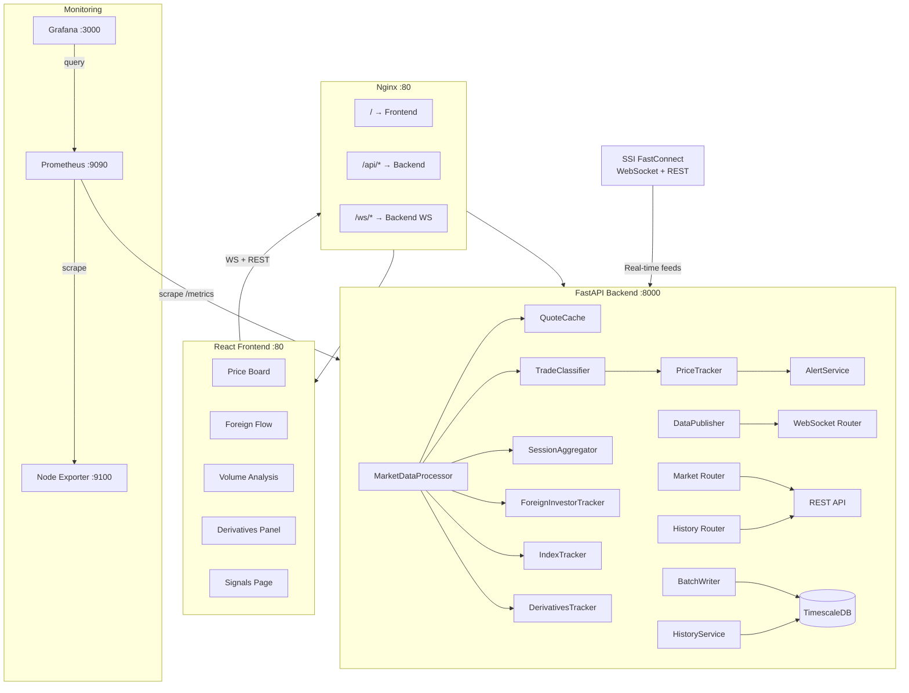
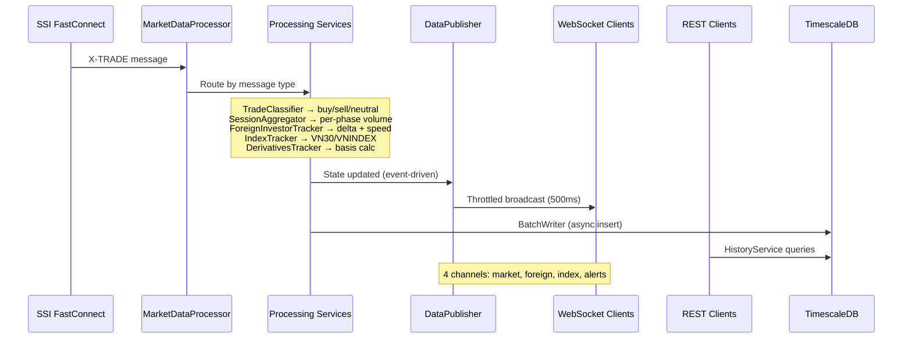
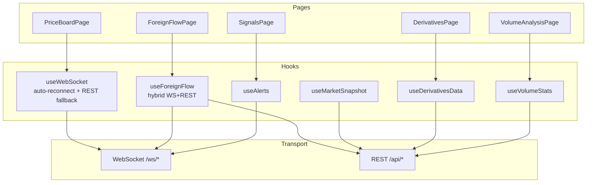
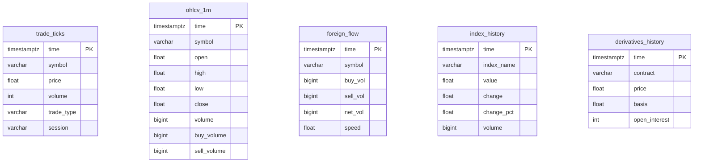
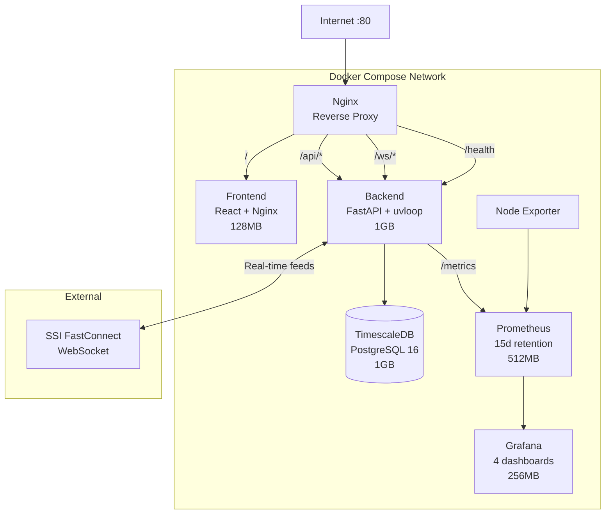

# System Architecture

## High-Level Overview



## Data Flow



## Message Routing

```mermaid
flowchart LR
    MSG[SSI Message] --> TYPE{Message Type}

    TYPE -->|X-TRADE| TC[TradeClassifier]
    TYPE -->|X-Quote| QC[QuoteCache]
    TYPE -->|R:ALL| FIT[ForeignInvestorTracker]
    TYPE -->|MI:VN30| IT[IndexTracker]
    TYPE -->|MI:VNINDEX| IT
    TYPE -->|VN30F trade| DT[DerivativesTracker]

    TC --> SA[SessionAggregator]
    TC --> PT[PriceTracker]
    PT -->|anomaly| AS[AlertService]

    AS -->|broadcast| ALERT[/ws/alerts]
```

## Backend Services

| Service | Responsibility | Input | Output |
|---------|---------------|-------|--------|
| `SsiAuthService` | OAuth2 token management | Consumer ID/Secret | Access token |
| `SsiMarketService` | REST lookups (VN30 components, securities) | Token | Market data |
| `SsiStreamService` | WebSocket connection + reconnect | Token | Raw messages |
| `SsiFieldNormalizer` | SSI field name → standard names | Raw dict | Normalized dict |
| `FuturesResolver` | Determine active VN30F contract | Date | Contract symbol |
| `QuoteCache` | Bid/ask price storage | Quote messages | Latest quotes |
| `TradeClassifier` | Classify trades as buy/sell/neutral using `LastVol` | Trade + quotes | ClassifiedTrade |
| `SessionAggregator` | Volume accumulation per session phase | ClassifiedTrade | SessionStats |
| `ForeignInvestorTracker` | Delta, speed, acceleration per symbol | R channel | ForeignInvestorData |
| `IndexTracker` | VN30/VNINDEX real-time values | MI messages | IndexData |
| `DerivativesTracker` | Futures price, basis vs spot | VN30F trades | DerivativesData |
| `PriceTracker` | 4 signal detectors (volume, price, foreign, basis) | All services | Alert triggers |
| `AlertService` | Dedup + buffer + WS broadcast | Alert triggers | Alert stream |

## Frontend Architecture



### Hybrid Data Strategy

| Channel | Transport | Update Freq | Payload |
|---------|-----------|-------------|---------|
| Market snapshot | WebSocket `/ws/market` | 500ms throttle | Quotes + indices + foreign summary |
| Foreign detail | REST `/api/market/foreign-detail` | 10s polling | Full per-symbol breakdown |
| Derivatives basis | REST `/api/market/basis-trend` | 10s polling | Historical basis points |
| Alerts | WebSocket `/ws/alerts` | Real-time | Alert objects |
| Volume stats | REST `/api/market/volume-stats` | 10s polling | Per-symbol session stats |

## Database Schema



All tables use TimescaleDB hypertables with automatic time-based partitioning.

## Deployment Architecture



## Session Phases

VN stock market operates in distinct phases:

| Phase | Time (ICT) | Trading |
|-------|-----------|---------|
| Pre-open | 09:00-09:15 | ATO auction |
| Morning | 09:15-11:30 | Continuous |
| Lunch | 11:30-13:00 | Closed |
| Afternoon | 13:00-14:30 | Continuous |
| Close | 14:30-14:45 | ATC auction |
| Post-close | 14:45-15:00 | Put-through |

Trades are tagged with session phase for per-phase volume breakdown.

## Alert Types

| Alert | Trigger | Severity |
|-------|---------|----------|
| `VOLUME_SPIKE` | Volume >3x 5-min average | WARNING/CRITICAL |
| `PRICE_BREAKOUT` | Price crosses key levels | WARNING |
| `FOREIGN_ACCELERATION` | Foreign speed change >2σ | WARNING/CRITICAL |
| `BASIS_DIVERGENCE` | Futures-spot spread anomaly | WARNING |

Alerts are deduplicated (60s cooldown per symbol+type) and broadcast via `/ws/alerts`.

## Performance Characteristics

| Component | Metric | Value |
|-----------|--------|-------|
| MarketDataProcessor | Throughput | 58,874 msg/s |
| TradeClassifier | Latency | <1ms |
| ForeignInvestorTracker | Latency | <0.5ms |
| DataPublisher | WS broadcast | 500ms throttle |
| BatchWriter | DB insert | Async batch (1s window) |
| WebSocket | p99 latency | 85-95ms |
| REST API | p95 latency | 175-195ms |
